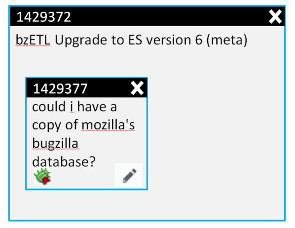

# bugzilla-tiles
Manage Bugzilla bugs as tiles with short notes

## Problem

I like to track my work in a Notepad, with each line representing a TODO item. Tracking bugs this way has low administrative cost, and a high bug density.

Using a bug tracker, like Bugzilla, is good for team communication; but like all communication, it has costs:

* Long page load times - a few seconds to load/save a page breaks the flow of prose in my head
* Visually complex - There are multiple fields I never use, or always have the same value entered. 
* Lots of scrolling - the ui complexity forces user to scroll, slowing down data entry 
* Hard to search - There are too many bugs I am not interested in. I want a shortlist of what I am working on.
* Not sure if formatted correctly - WYSIWYG comments would be nice.

## Solution - Tiles!

I propose a kanban-style tracking tool. Each bug is represented as tile with the bug's short description.

### Bugs are Tiles

Each Bug tile is decorated with

* Short description
* Bug number
* An "X" to close the bug, and a way to reverse that decision (?ctrl-Z?)
* Dependent bugs - A bug with dependencies will expand to hold 
* A button to click to add a comment
* A button to click to go to Bugzilla
* A button to click to add a blocker bug - Assumed to be in same component.
* A region to hover to see the bug summary 
* A region to drag blocker bugs into (at which point the bug is now a container)

### Container Tiles

There will be other tiles, containers really, that will represent a variety of bug states. I propose a few to begin

* Product::Component - Containers that bugs can be moved between to control component they are in (or to make new bug in)
* Whiteboard tag - Containers that represent bugs with a particular whiteboard tag
* Keywords - same as whiteboard
* Dependencies - As mentioned above, we can view the dependency tree of bugs as tiles-in-tiles
* New-InProgress-Complete - A typical 3-part kanban tracking container

Since each of these properties can vary independently, only one can be shown at a time. I would imagine the bottom of the screen will have a radio button of all the container tiles so they can be selected-and-viewed.   

Containers have decoration that is different than bugs

* Title with component/tag/keyword 
* Large region that contains the bugs which match container's criterion
* A way to hide bugs that match criterion
* A way to show all open bugs that match container's criterion
* A button to click to show Bugzilla list
* A button to click to show new-bug defaults (component, tags, blockers, etc)

   

## Implementation Plan

I imagine this implemented as a React/JSX app. The biggest complication I see is finding/making a library that will be responsible for drawing, moving, and saving these tiles. Once this is available, the rest of the project can proceed.

### Priorities

1. Making dependent bugs - This is the most important because it is most like the Notepad tracking; the ability to make new bugs quickly in a component. This means there are component container tiles with some "+" button for adding bugs.
2. Go to Bugzilla - So we can go to Bugzilla and do the rest of the markup that this UI can not do
3. Drag-and-order - The visual ordering of the bugs in containers is important for organization despite the fact it does not change what is in Bugzilla.  At this point the tiles need not be tiles yet; maybe they are simple `div` or `li` on a page.  The click-and-drag is important here.

## Hopes and Dreams

* Use Github too!
* Manage Github<->Bugzilla cross-referenced bugs elegantly
* Drag-and-drop bugs into issues, and reverse!

## Existing Solutions

Please add a PR with any existing solutions!